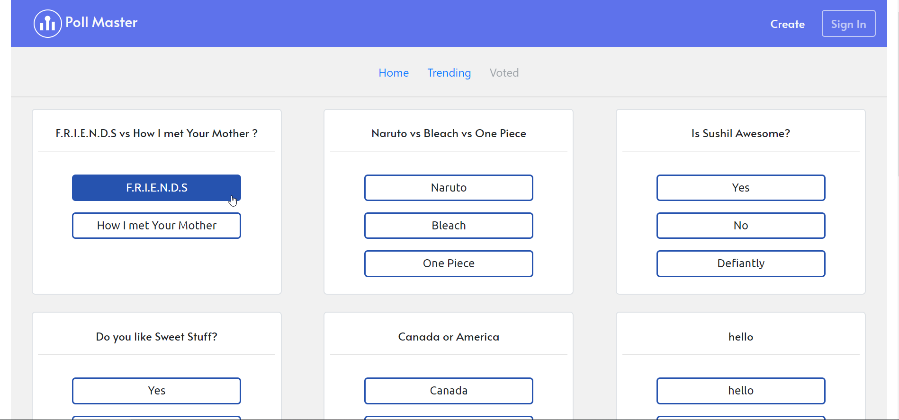
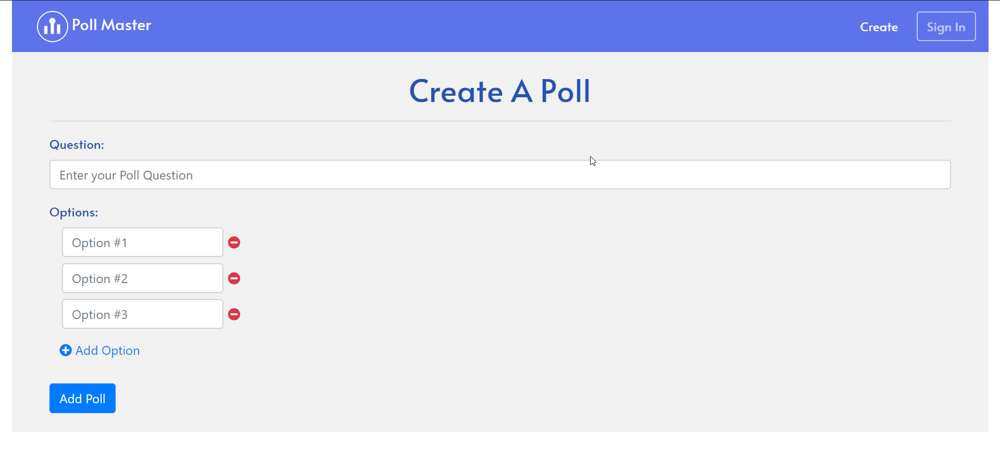

# Poll Master

  

<h6 align="center"> A polling app based on MERN Stack </h6>

Poll master is a Web app which is built with MERN Stack. It is simple web app where you
can vote on polls created by others and also create your own polls.

## Goals
The main goal of this project was to learn MERN stack and also to learn how to colaborate in git, 

## Contributors
* [SushilBajracharya01](https://github.com/SushilBajracharya01)
* [MukeshMahara](https://github.com/mukeshmahara)
* [SajanDhakal](https://github.com/CodeDestroyer12)
* dependabot :D 

## Demo
👉 live demo: <a href="https://pollmaster-v2.herokuapp.com" target="_blank" >here</a>

## Features

- [x] Create Poll
- [x] Vote on Polls
- [x] simple animations
- [X] nice UI
- [x] responsive design
- [ ] User authentication
- [ ] single vote policy

## Built with
- [Mongodb](https://www.mongodb.com/)
- [ExpressJs](https://expressjs.com/)
- [ReactJs](https://reactjs.org/)
- [NodeJs](https://nodejs.org/en/)

## License

MIT  © 
